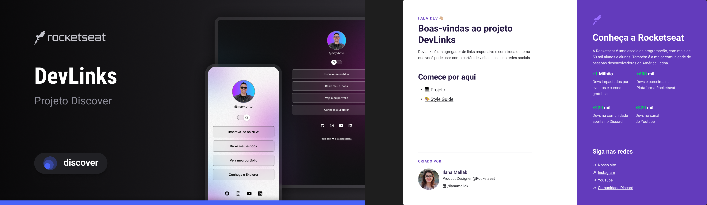

<h1 align="center"> Evoluções </h1>

Evento exclusivo e gratuito, promovido pela Rocketseat para ensino de tecnologias WEB.

  <a href="#-tecnologias">Tecnologias</a>&nbsp;&nbsp;&nbsp;|&nbsp;&nbsp;&nbsp;
  <a href="#-projeto">Projeto</a>&nbsp;&nbsp;&nbsp;|&nbsp;&nbsp;&nbsp;
  <a href="#-layout">Layout</a>&nbsp;&nbsp;&nbsp;|&nbsp;&nbsp;&nbsp;
  <a href="#-licença">Licença</a>

  

 

  

## 🚀 Tecnologias

Esse projeto foi desenvolvido com as seguintes tecnologias:

- HTML e CSS
- JavaScript
- Git e Github
- Figma

## 💻 Projeto

Projeto desenvolvido para aprendizagem de novas tecnologias e ferramentas, feliz por esta me empenhando e aprendendo cada vez mais!
[Acesse aqui](https://www.figma.com/design/BfClE4IFJo36VXiOslgTTQ/DevLinks-%E2%80%A2-Projeto-Discover-(Community)?node-id=10-620&t=7UrpcoquW2Po9Hjg-0](https://martinsalan2003.github.io/direction-portfolio/)).

## 🔖 Layout

Você pode visualizar o layout do projeto através [DESSE LINK](https://www.figma.com/design/BfClE4IFJo36VXiOslgTTQ/DevLinks-%E2%80%A2-Projeto-Discover-(Community)?node-id=10-620&t=7UrpcoquW2Po9Hjg-0). É necessário ter conta no [Figma](https://figma.com) para acessá-lo.

## Licença

Esse projeto está sob a licença MIT.

---

